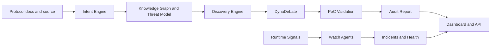

# Architecture

SRP is organized as a security operating system rather than a chatbot. The core package owns deterministic security reasoning primitives, while the API exposes SaaS-facing workflows and the web app provides operator visibility.

## Systems

- Agent Operating System: `AgentRegistry`, `SharedMemory`, and `OrchestrationEngine` support registered agents, retries, sequential execution, parallel execution, debate flows, and verification flows.
- Protocol Intent Engine: parses docs and source into assumptions, guarantees, trust boundaries, attack surfaces, invariants, a knowledge graph, and threat model.
- Vulnerability Discovery Engine: applies EVM and Solana detector rules and emits findings only with concrete evidence spans.
- DynaDebate Engine: attacker, defender, and judge rounds raise or reduce confidence before validation.
- Proof of Concept Engine: classifies findings as proven, partial, or failed and prevents unverified high severity promotion.
- Runtime Security Layer: watch agents ingest mempool, governance, treasury, liquidity, bridge, staking, and invariant signals; anomalies become incidents.
- MCP Infrastructure: external intelligence belongs behind installable adapters. Core engines depend on typed inputs and do not need code changes when a new adapter is added.
- Backend: Node.js REST API, SSE streaming, bearer authentication, RBAC, rate limiting, audit log, audit storage, report rendering, and monitoring storage.
- Frontend: security operations dashboard with live audit, agents, findings, exploit validation status, monitoring alerts, and protocol health.

## Data Flow

## Evidence Policy

Every finding has file, line, excerpt, and rationale evidence. High severity candidates that are not proven by validation are downgraded to medium until executable proof exists.
